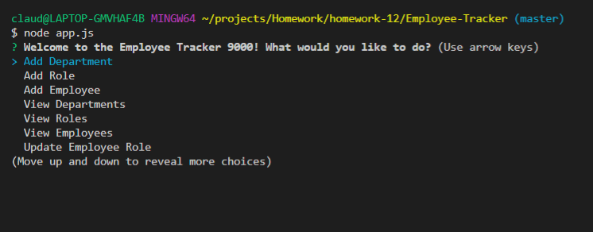
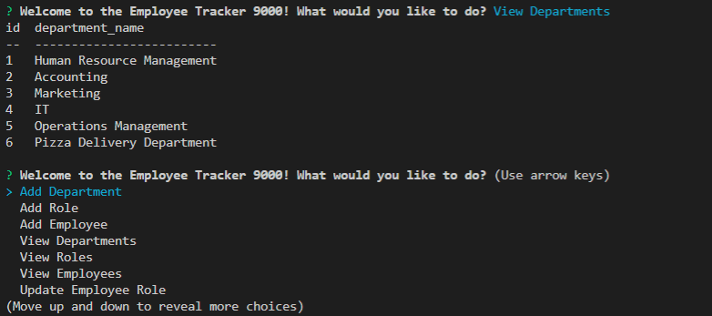
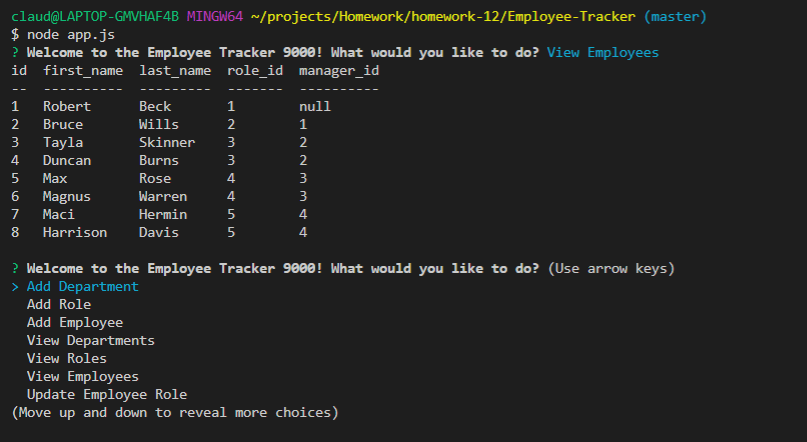
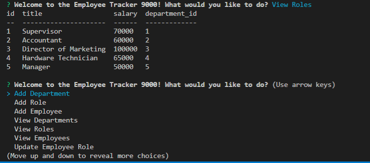

# Employee-Tracker

App allows the user to:
  
  * Add departments, roles, employees

  * View departments, roles, employees

  * Update employee roles
  
  stores app information in mysql database and is acccessed in the console using inquirer.

INITIAL CHOICES PROMPT

DEPARTMENTS

EMPLOYEES

ROLES

